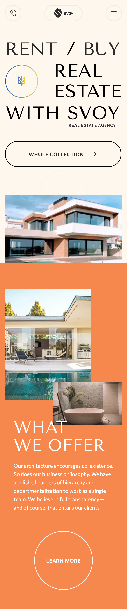
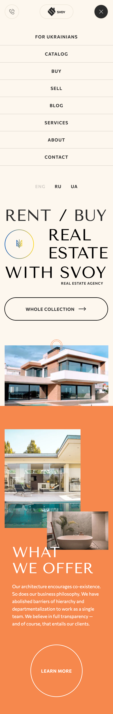

# Svoy App

## Technology used:

- TypeScript
- React / NextJS
- Prettier
- Eslint
- MUI
- SCSS

## Additionally:

- Pixel perfect
- Design (Figma)
- CI/CD
- Adaptive

## Laptop


## Tablet


## Mobile



## Mobile with menu




## Getting Started

First, run the development server:

```bash
npm run dev
# or
yarn dev
# or
pnpm dev
# or
bun dev
```


